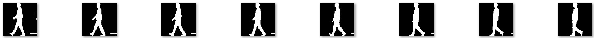
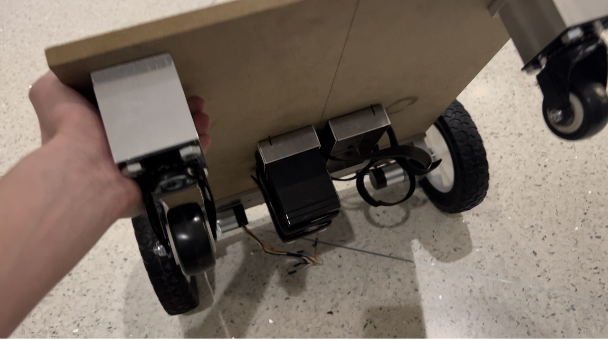
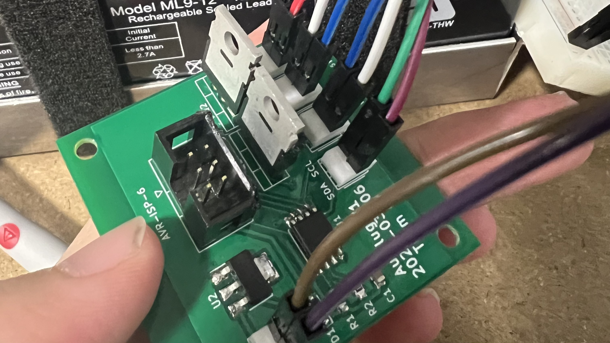
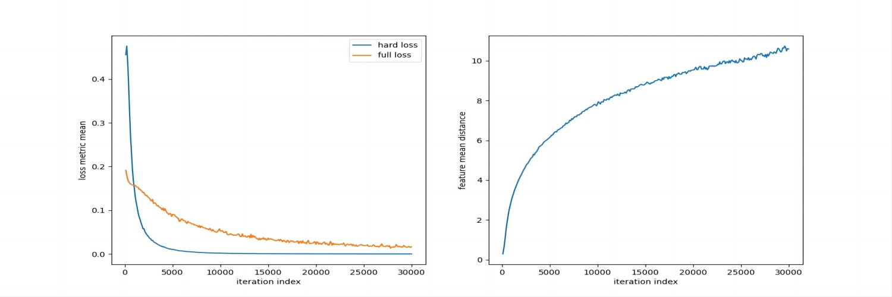
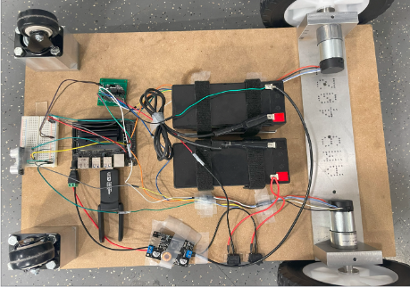
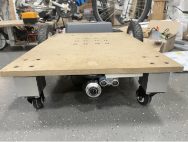
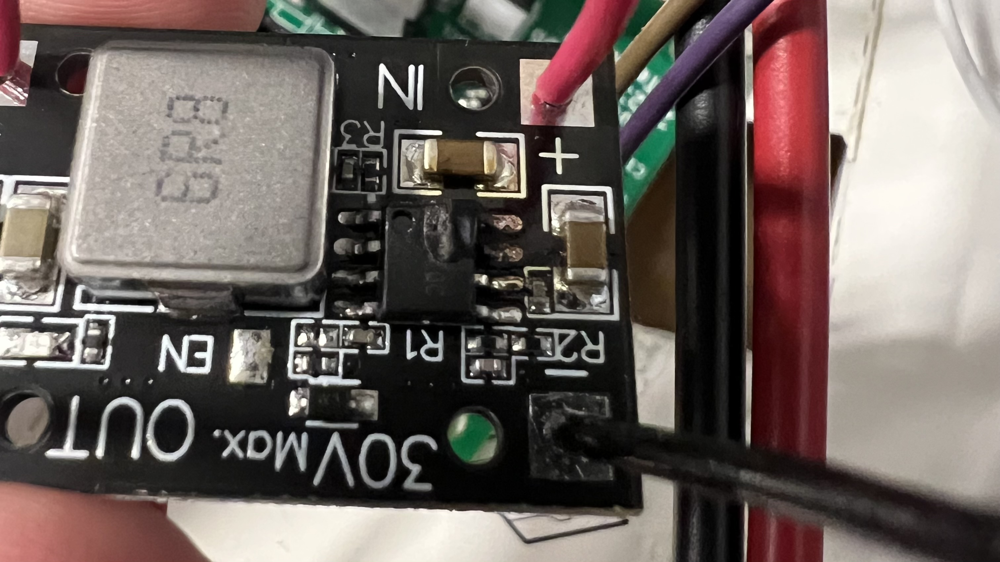
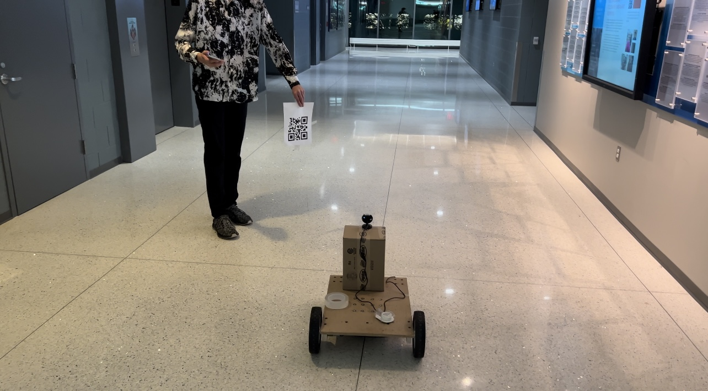

# Lyuxing Lab Notebook
## Table of contents
1. [Shopping List Confirmed](#2023-02-20---shopping-list-confirmed)
2. [PCB](#2023-03-26---pcb-initial-check)
    1. [Initial Check](#2023-03-26---pcb-initial-check)
    2. [Soldering](#2023-03-29---pcb-soldering)
    3. [Buck Converter Issue](#2023-04-18---pcb-buck-converter-issue)
    4. [I2C Issue](#2023-04-21---pcb-i2c-issue)
3. [Drivetrain](#2023-03-28---drivetrain-subsystem-platform-received)
    1. [Platform Received](#2023-03-28---drivetrain-subsystem-platform-received)
    2. [Platform Assembly](#2023-04-10---drivetrain-subsystem-platform-assembly)
    3. [Motor Issue](#2023-04-16---drivetrain-subsystem-motor-issue)
    4. [Speed Issue](#2023-04-23---drivetrain-subsystem-speed-issue)
4. [Human Identification & Tracking](#2023-03-01---human-recognition-subsystem-gait-gait-recognition-algorithm-search)
    1. [Gait Based](#2023-03-01---human-recognition-subsystem-gait-gait-recognition-algorithm-search)
        1. [Gait Recognition Algorithm Search](#2023-03-01---human-recognition-subsystem-gait-gait-recognition-algorithm-search)
        2. [GaitSet Installation](#2023-03-05---human-recognition-subsystem-gait-gaitset-installation)
        3. [GaitSet End-to-end Realization](#2023-03-15---human-recognition-subsystem-gait-gaitset-end-to-end-realization)
        4. [End-to-end Gaitset Accuracy Eval](#2023-04-01---human-recognition-subsystem-gait-end-to-end-gaitset-accuracy-eval)
        5. [Onboard Testing and Issue](#2023-04-15---human-recognition-subsystem-gait-onboard-testing-and-issue)
    2. [QR-code Based](#2023-04-20---human-recognition-subsystem-qr-transition-to-qr-code)
        1. [Transition to QR code](#2023-04-20---human-recognition-subsystem-qr-transition-to-qr-code)
        2. [Onboard Testing and Issue](#2023-04-22---human-recognition-subsystem-qr-onboard-testing-and-issue)
        3. [Resolving Issue 1](#2023-04-24---human-recognition-subsystem-qr-resolving-issue-1)
        4. [Resolving Issue 2](#2023-04-25---human-recognition-subsystem-qr-resolving-issue-2)
5. [Demo](#2023-04-26---project-complete)

## 2023-02-20 - Shopping List Confirmed
- 20W DC-DC buck converter power module with 7~24V input and 5V/4A output
- N-channel power MOSFET - 30V / 60A
- 80 pieces Female to Female Jumper Wires (4 and 8 Inch)
- 50 pieces Male to Female Jumper Wires (50cm)
- 1 12V battery

## 2023-03-01 - Human Recognition Subsystem (Gait): Gait Recognition Algorithm Search
The most effective approach for identifying human using motion information is perhaps gait recognition. A survey is conducted on state-of-art gait recognition algorithms is conducted with a focus on algorithms with sample-effeicient feature in training phase (since we don't want the onwer to take tons of photos/ videos to train AutoLug to recognize him/herself).

## 2023-03-05 - Human Recognition Subsystem (Gait): GaitSet Installation
After reviewing multiple state-of-art gait recognition algorithms, GaitSet (https://ieeexplore.ieee.org/document/9351667) is found to be the most suitable algorithm for our project, with code in PyTorch found (https://github.com/AbnerHqC/GaitSet). GaitSet is extremely sample efficient, as it only requires a set of gait silhouettes, does not require them to be consecutive, and is not dependent on the permutation of each silhouette image. GaitSet is also fast training as it only requires 7 min to perform eval on OU-MVLP. In addition, it's very effective in terms of accuracy, as it achieves Rank@1=95.0% on CASIA-B and Rank@1=87.1% on OU-MVLP, excluding identical-view cases.

## 2023-03-15 - Human Recognition Subsystem (Gait): GaitSet End-to-end Realization
To make GaitSet compatible with our project, we need to leverage GaitSet into an end-to-end human recognition algorithm, since the provided code of GaitSet only takes in gait silhouettes from the dataset. To extract gait silhouettes from the raw video stream, several tricks have to be applied here. First of all, background subtraction needs to be performed in order to segment the human body out. This is done via convolutiong the image frame with a BackgroundSubtractorKNN. Then, the processed image needs to be enhanced using some low-level computer vision technique. It has to be first gaussian-blurred to smooth the entire image. Then, the image is eroded and dilated for shaping the gait silhouette image. Lastly, the image will be thresholded to produce a black-white image and used as a gait silhouette image. Note that the kernel size for errosion and dialation and bound for thresholding all require tuning. The following image is a produced gait silhouette sets from a video found here: https://www.csc.kth.se/cvap/actions/.

## 2023-03-26 - PCB: Initial Check
The PCB board order has arrived on 03/28 and an initial check was conducted. After examining the PCB board and the electronic pieces to be soldered, one severe problem has revealed. The planned ESP32 pin layout on the PCB board does not match the ESP32 chip we have. Two solutions have been proposed: we reorder a new PCB board with updated pin layout with the ESP32 chip we have right now, or order additional ESP32 chips with matched pin layout with the PCB board we have right now. We decide to discuss with our TA about this issue before proceeding. 

## 2023-03-28 - Drivetrain Subsystem: Platform Received
The machine shop has finished building the machenical frame of the platform with motors and wheels mounted!

## 2023-03-29 - PCB: Soldering
Luckily we were able to obtain a legacy ESP32 from previous semesters' left-overs with matching pin layout as out PCB board. The PCB is soldered and colored wires are attached for the convenience of identifying pins.

## 2023-04-01 - Human Recognition Subsystem (Gait): End-to-end Gaitset Accuracy Eval
To validate accuracy of the end-to-end version of GaitSet, a video stream is used to produce gait silhouette sets used for training. Then, other video streams containing the target are used as inputs to the recognition subsystem and performance is evaluated. Experiments are conducted using the following datasets: KTH (https://www.csc.kth.se/cvap/actions/), Kaggle version (https://www.kaggle.com/datasets/saimadhurivasam/human-activity-recognition-from-video), TUM-Gait (https://www.ce.cit.tum.de/en/mmk/verschiedenes/tum-iitkgp-gait-database/). The overall accuracy achieved is around 82%, which is slightly less than the proposed accuracy in the paper but is decent enoungh. The following images are the training performance of the human recognition subsystem based on GaitSet.

## 2023-04-10 - Drivetrain Subsystem: Platform Assembly
Most hardware (electronics, sensors, etc.) have been assembled today. The image below shows the overall appearance of AutoLug.

## 2023-04-15 - Human Recognition Subsystem (Gait): Onboard Testing and Issue
A severe issue is found when trying to implement the GaiSet based human recognition subsystem on the AutoLug. Since the platform is supposed to be tracking the back of the owner, the back-view gait image is entirely different than the testing case of side-view gait image (which is more informative). Secondly, since the camera is mounted at the bottom of the platform, if the platform is getting too close to the owner it will not be able to capture the entire gait motion and therefore fail to perform identification. 

## 2023-04-16 - Drivetrain Subsystem: Motor Issue
We've uploaded the control subsystem to ESP32 and attemped to drive the motor with a constant speed command from Jeston Nano. However, for some reason the motor does not turn. We investigated the issue and realized that the grounds of the PCB board are not connected, causing the gate voltage to never reach V_on. We connected all grounds of the PCB board using flying 10k ohm resistors, and the motor starts to turn. Issue revolved. 

## 2023-04-18 - PCB: Buck Converter Issue
For some reason the buck converter is always burned whenever a 24V input is provided to the input channel of the board. We've lost both buck converters we have, and therefore we decided to purchase a more robust buck converter available here (https://www.amazon.com/dp/B07JZ2GQJF?psc=1&ref=ppx_yo2ov_dt_b_product_details) that can monitor input&output voltage&current to prevent further damage to our PCB board and batteries. The following image is a burned buck converter.

## 2023-04-20 - Human Recognition Subsystem (QR): Transition to QR code
The mentioned problem above seem to cannot be easily resolved, therefore a different human identification technique is proposed. The new techinque will be QR code based, i.e. the owner will register him/herself with AutoLug, and AutoLug will return a QR code specific to the owner. Therefore, human recognition problem is reduced to QR code detection and QR code decode problem. We used some OpenCV APIs to realized QR code detection and decoding feature, and the image below shows that this method is able to detect&decode all QR codes and return a bounding box around the QR code that encodes the correct message ("abcd" in the case of the image shown below).

## 2023-04-21 - PCB: I2C Issue
For some reason the I2C communication channel die frequently when the motors are tuning, and the issue is getting worse when the platform is actually driving on the ground. We investigated the issue and first thought that it was caused by the lack of flyback diodes acorss the motors. However, adding the flyback diodes did not revolve the issue but disenabled controllability of the motors. We then realized the issue was caused by signal interference from the motor channel, as I2C communication channel is right next to motor channel. We seperate the I2C channel and the motor chanel using electric-duct tapes, and the issue is revolved.

## 2023-04-22 - Human Recognition Subsystem (QR): Onboard Testing and Issue
The QR code method turns out to be able to correctly identify its registered owner. However, this method is highly unstable. More specifically, it will frequently lose its owner during the active period. Various reasons could lead to this problem, including camera resolution, motion blur, distorted image caused by tilted viewing angle, etc.

## 2023-04-23 - Drivetrain Subsystem: Speed Issue
We've noticed that for some reason the right motor is always turning much slower than the left motor, and one of the motors have much higher resistance when freely rolling it in both directions. We investigated the issue and realized that one of the motor lost its screws and therefore it was not firmly attached to the wheel. We are able to retrieve the screw and the issue is resolved.

## 2023-04-24 - Human Recognition Subsystem (QR): Resolving Issue 1
The motion blur issue seems to be unsolvable given the hardware setting we have, and therefore an attempt was made to solve the distorted image caused by tilted viewing angle via performing warping on the image frame before passing into the QR code pipeline. The performance was slightly improved after this change. A another attempt to revolve this issue is to mount the camera ontop of the platform instead of below it. The changed setting is shown in the following image, but this change does not create any noticible impact and thus is reverted to the original setting.

## 2023-04-25 - Human Recognition Subsystem (QR): Resolving Issue 2
To make the tracking more consistent, we decided to incorporate object tracking method provided by OpenCV and use together with the QR code pipeline. More specifically, the QR code pipeline will give a bounding box for the QR code of the correct owner, and if QR code lost the owner the object tracking pipeline will use the latest bounding box from QR code pipeline and track that image. It turns out that this approach has significantly improved the performance of AutoLug.

## 2023-04-26 - Project Complete
After some fine-tuning, we officially concluded AutoLug project! The following two videos demonstrate AutoLug's functionalities under manual mode and autonomous tracking mode.

